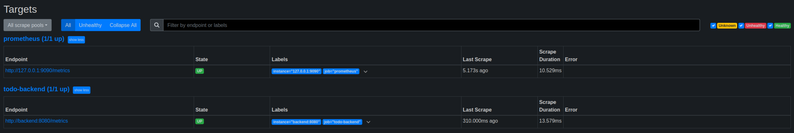
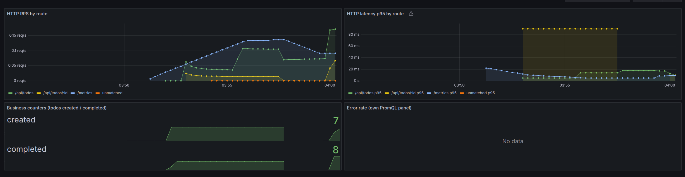
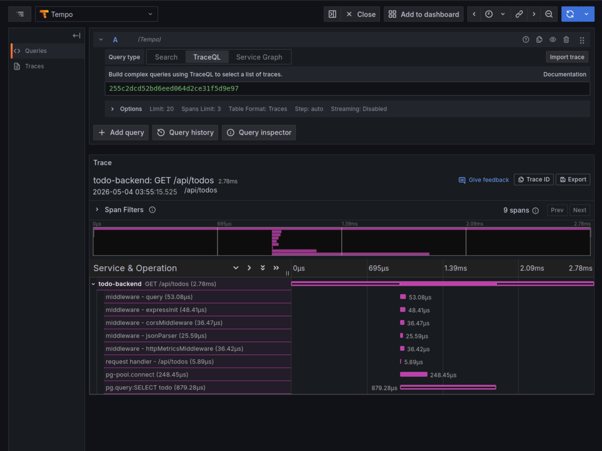

# Лабораторная работа №7: Observability

## Что реализовано

### 1. Метрики (`backend/src/metrics.js`)

Эндпоинт `/metrics` экспортирует метрики в формате Prometheus.

**HTTP-метрики:**


| Метрика                  | Тип    | Labels                    |
| ------------------------------- | --------- | ------------------------- |
| `http_requests_total`           | Counter   | `method`,`route`,`status` |
| `http_request_duration_seconds` | Histogram | `method`,`route`,`status` |

Label `route` содержит шаблон маршрута (`/api/todos/:id`), а не сырой path — кардинальность контролируется.

**Бизнес-метрики:**


| Метрика          | Тип  | Описание                                       |
| ----------------------- | ------- | ------------------------------------------------------ |
| `todos_created_total`   | Counter | Количество созданных задач     |
| `todos_completed_total` | Counter | Количество завершённых задач |

Трейсинг реализован в `backend/src/telemetry.js` через OpenTelemetry SDK. Включается переменной `OTEL_EXPORTER_OTLP_ENDPOINT`. Без переменной приложение работает штатно — трейсинг отключается автоматически.

### 2. Стек наблюдаемости (`observability/`)

Grafana datasources подключаются автоматически через provisioning: **Prometheus**, **Tempo**, **Loki**.

Дашборд `lab7-todo-backend.json`, папка **Lab7**:


| Панель                               | PromQL                                                                                         |
| ------------------------------------------ | ---------------------------------------------------------------------------------------------- |
| HTTP RPS by route                          | `sum by (route) (rate(http_requests_total[5m]))`                                               |
| HTTP latency p95                           | `histogram_quantile(0.95, sum by (le,route) (rate(http_request_duration_seconds_bucket[5m])))` |
| Business counters                          | `todos_created_total`,`todos_completed_total`                                                  |
| Error rate (собственный PromQL) | `100 * sum(rate(http_requests_total{status=~"5.."}[5m])) / sum(rate(http_requests_total[5m]))` |

---

## Запуск

```bash
docker compose -f docker-compose.yml -f docker-compose.observability.yml up -d
```


| Сервис | URL                   | Логин    |
| ------------ | --------------------- | ------------- |
| Frontend     | http://localhost:3000 | —            |
| Backend API  | http://localhost:8080 | —            |
| Prometheus   | http://localhost:9090 | —            |
| Grafana      | http://localhost:3001 | admin / admin |
| Tempo        | http://localhost:3200 | —            |
| Loki         | http://localhost:3100 | —            |

---

## Скриншоты

### Prometheus — Targets

job `todo-backend` в статусе **UP**:



### Grafana — Дашборд

Дашборд Lab7 с HTTP RPS, latency p95, business counters:



### Grafana — Tempo trace

Развёрнутый trace `GET /api/todos` с 9 span-ами (middleware, pg-pool.connect, pg.query:SELECT):


